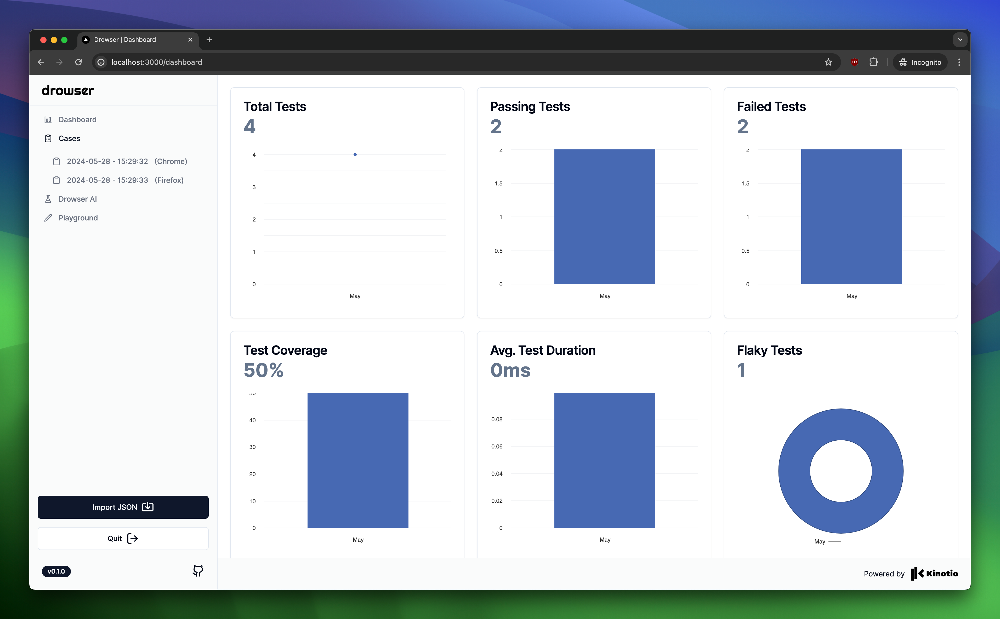
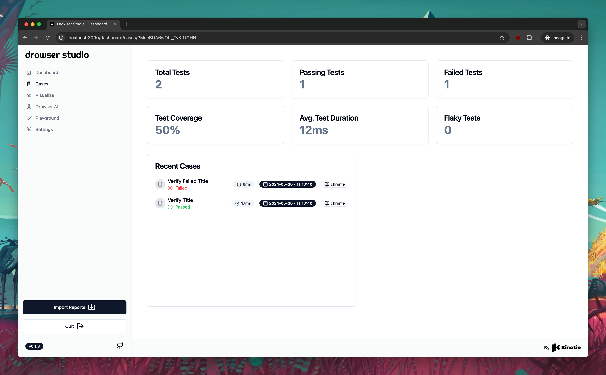

<p align="center">
  
</p>


Drowser Studio is a robust and intuitive app designed to help users track, visualize, and analyze the performance of various tests over time. 📈🚀

> This Drowser Studio depend from reports collected from the Drowser Deno Package who is available on Denoland 🦕

You can find the `Drowser` lib from Denoland [here](https://deno.land/x/drowser)

## Usage

Pull directly the Drowser image from the Github Container Registry:

```sh
docker pull ghcr.io/kinotio/drowser-studio:latest
```

And run it

```sh
docker run --name kinotio_drowser_studio -p 3000:3000 -d ghcr.io/kinotio/drowser-studio:latest
```

## Features

### Landing Page

Import your reports on the landing page

<p align="center">
  
</p>

### Dashboard

You can access to the main cases dashboard to get a visulization , track passed or failed cases , get an overview of all informations from each test cases

<p align="center">
  
</p>

### Cases

And, in the other view you can access directly the metric from each test case

<p align="center">
  
</p>

### Drowser AI

We're still working with this feature to get able to ask the AI to get a prediction and analyse from the test data 🛠️🤖

### Playground

We're still working with this feature to get able to write directly from the platform app instead of using the [Drowser](https://deno.land/x/drowser) Deno lib 🛠️✍🏻

## Build from source

You can use Docker to use it as service inside a container or test it in your local machine
Clone the repository and change directory to be inside of the repository directory and run these commands

Build the Docker image with this command

```sh
docker build -t kinotio/drowser-studio .
```

And, run it with this

```sh
docker run --name kinotio_drowser_studio -p 3000:3000 -d kinotio/drowser-studio
```

## License

This project is licensed under the MIT License - see the [LICENSE](LICENSE) file for details.
