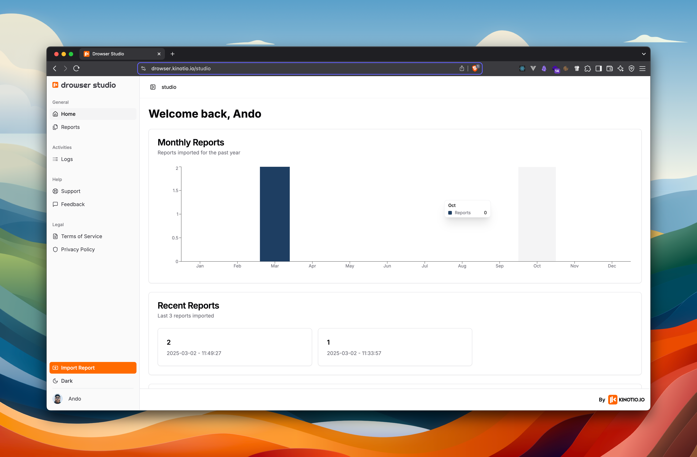

<p align="center">
  
</p>

<p align="center">
  
</p>


Drowser Studio is a robust and intuitive app designed to help users track, visualize, and analyze the performance of various tests over time. 📈🚀

> This Drowser Studio depend from reports collected from the Drowser Deno Package who is available on Denoland 🦕

You can find the `Drowser` lib from Denoland [here](https://deno.land/x/drowser)

## Setup

Install dependencies:

```bash
$ pnpm install
```

And then install Infisical CLI [here](https://infisical.com/docs/cli/overview), then run the following command:

```bash
$ infisical run -- pnpm run dev
```

## License

This project is licensed under the MIT License - see the [LICENSE](LICENSE) file for details.
